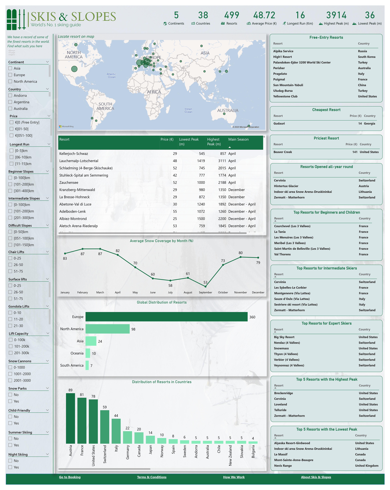

# Maven Slopes Challenge

## Introduction
This is a Power BI project on the Maven Slopes Challenge organized by Maven Analytics. The goal of the project is to create a one-page dashboard to help skiers find their ideal skiing destination.
## Skills demonstrated
The following Power BI skills were incorporated into this project:
- Data transformation.
- Knowledge of DAX functions.
- Data Visualization.
## Data sourcing
The data set provided by Maven Analytics contained data on 499 ski resorts in 5 continents and 38 countries of the world (resorts.csv). It also included complementary data on the snow cover around the world during each month of 2022 (snow.csv) and the data dictionary. Here's the link to the [data set](https://maven-datasets.s3.amazonaws.com/Ski+Resorts/Ski+Resorts.zip)
## Data Transformation
First, it was observed that the data needed to be cleaned. Characters like question marks, forward slashes, hyphens, and underscores were found to be overused in the 'Resort' column of the 'resorts.csv' data set and this was cleaned using the Find and Replace option on Microsoft Excel. The cleaning process of the resort names involved doing a Google search to get a more appropriate name for these resorts. Additionally, custom columns were created to provide a better interpretation of this data set. To extract the months from the dates in the 'snow.csv' data set, the FORMAT function was used, and the MONTH function was then used to extract the corresponding month numbers which was used to sort the months column for the analysis.
## Solving the problem
One major challenge for skiers would be the difficulty of finding the best ski resort based on the facilities available such as Longest runs, Highest Points, Lowest Points, Beginner Slopes, Intermediate Slopes, etc. To solve this problem, a custom column was created using the IF function to create bins for these continuous variables. This would help create important filters necessary to guide skiers to their next skiing destination.
## Visualization
The single-page dashboard is user-friendly with several helpful filters on the left-hand side that would guide tourists to their most preferred destination. Summarized lists of the most interesting features of the ski resorts are on the right-hand side. Skiers have a quick view of the following:
- The free-entry resorts
- The cheapest resort
- The priciest resort
- The resorts that are open all year round
- The best resorts for beginners, intermediate and expert skiers
- The resorts with the highest peak and lowest peak

The interactive dashboard can be accessed on the Power BI service via this [link]().
